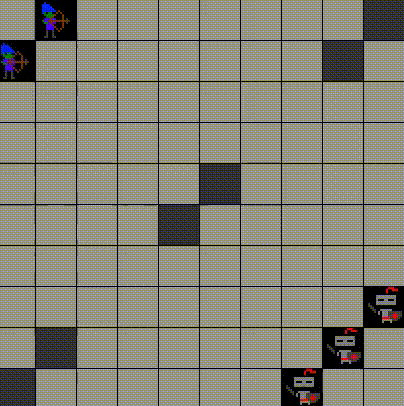

# nanoRTS

Платформа для изучения алгоритмов обучения с подкреплением



## Установка и начало работы

Скачиваем git-репозиторий (следующие команды вводятся в терминале):

```bash
# Клонируем репозиторий
git clone https://github.com/Zhurik/nano_rts.git

# Переходим в папку репозитория
cd nano_rts

# Устанавливаем зависимости
pip install -r requirements.txt

# Проверяем работу модуля
python nanoRTS/nanoRTS.py
```

 Если все установлено правильно, то будет выведена текстовая информация о среде в терминал и появится графическое отображение среды.


## Запуск обучения

В репозитории есть пример обычного Q-learning. Для его запуска необходимо запустить файл `Q_learning.py`:

```bash
python Q_learning.py
```

По умолчанию обучение будет производиться в сценарии, который указана в переменной `DEFAULT_FILE` в `Q_learning.py`.

Можно точно передать карту, на которой будет проходить обучение, к примеру:

```bash
python Q_learning.py ./scenarios/4_rooms_2W.json
```

В результате будет создан pickle файл с весами Q-таблицы и txt файл с результатами обучения: винрейт, количестов шагов, длительность и тп.

## Визуализация результатов обучения

Скоро будет...

## Ручное управление

Скоро будет...
