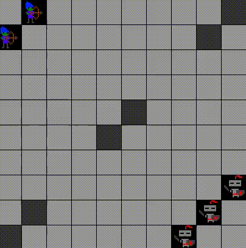
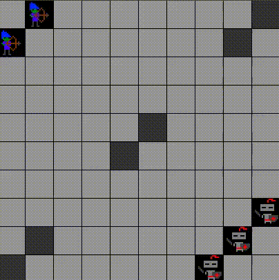
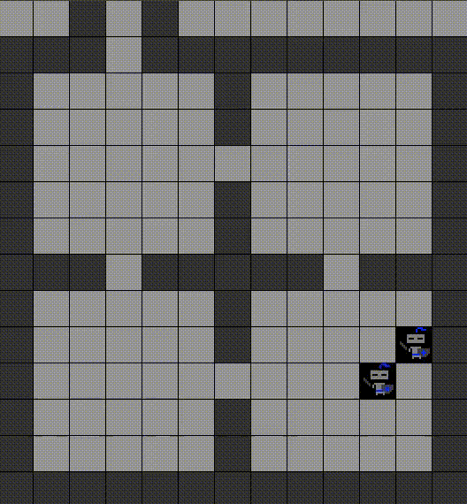
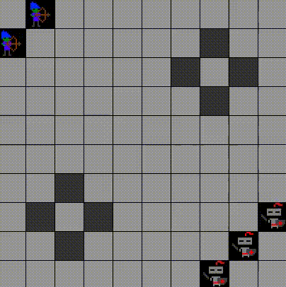

# nanoRTS

Платформа для изучения алгоритмов обучения с подкреплением

## Примеры обученных моделей

Сценарий simple_2Av3K:





Сценарий 4_rooms_2W:



Сценарий 2_forts_2Av3K со старым багом, когда агенты могли занимать одну клетку



## Установка и начало работы

Скачиваем git-репозиторий (следующие команды вводятся в терминале):

```bash
# Клонируем репозиторий
git clone https://github.com/Zhurik/nano_rts.git

# Переходим в папку репозитория
cd nano_rts

# Устанавливаем зависимости
pip install -r requirements.txt

# Проверяем работу модуля
python nanoRTS/nanoRTS.py
```

 Если все установлено правильно, то будет выведена текстовая информация о среде в терминал и появится графическое отображение среды.


## Запуск обучения

В репозитории есть пример обычного Q-learning. Для его запуска необходимо запустить файл `Q_learning.py`:

```bash
python Q_learning.py
```

По умолчанию обучение будет производиться в сценарии, который указана в переменной `DEFAULT_FILE` в `Q_learning.py`.

Можно точно передать карту, на которой будет проходить обучение, к примеру:

```bash
python Q_learning.py ./scenarios/4_rooms_2W.json
```

В результате будет создан pickle файл с весами Q-таблицы и txt файл с результатами обучения: винрейт, количестов шагов, длительность и тп.

## Визуализация результатов обучения

Скоро будет...

## Ручное управление

В рерозитории есть пример для ручного управления агентами. Для его запуска необходимо запустить файл `manual.py`

```bash
python manual.py
```

По умолчанию будет запущена карта, указанная в переменной `DEFAULT_FILE`.

Можно передать карту, на котрой будем играть, к примеру:

```bash
python manual.py ./scenarios/9_rooms_2W.json
```

### Управление

Управление осуществляется путем ввода кодов команд в терминале, к примеру

```bash
r a
```

заставит первого агента шагнуть вправо, а второго - атаковать.

Допускается вводить строчные и заглавные буквы.

### Допустимые команды для агентов Warrior в сценарии nanoROOMS

* `R` - шаг вправо
* `L` - шаг влево
* `U` - шаг вверх
* `D` - шаг вниз

### Допустимые команды для агентов Warrior в сценарии nanoRTS

* Все команды из предыдущего пункта
* `A` - атаковать

### Допустимые команды для агентов Archer

* Все команды из предыдущих пунктов
* `UR` - шаг по диагонали вверх и вправо
* `DR` - шаг по диагонали вниз и вправо
* `UL` - шаг по диагонали вверх и влево
* `DL` - шаг по диагонали вниз и влево
* `UU` - скачок на два шага вверх
* `RR` - скачок на два шага вправо
* `DD` - скачок на два шага вниз
* `LL` - скачок на два шага влево
