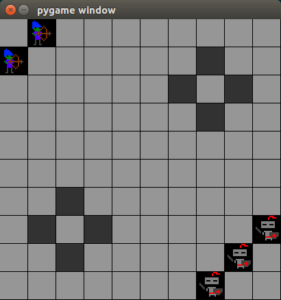

# nanoRTS

Платформа для изучения алгоритмов обучения с подкреплением

## Установка и начало работы

Скачиваем git-репозиторий (следующие команды вводятся в терминале):

```bash
# Клонируем репозиторий
git clone https://github.com/Zhurik/nano_rts.git

# Переходим в папку репозитория
cd nano_rts

# Устанавливаем зависимости
pip install -r requirements.txt

# Проверяем работу модуля
python nanoRTS/nanoRTS.py
```

 Если все установлено правильно, то будет выведена текстовая информация о среде в терминал и появится графическое отображение среды.



## Запуск обучения

Скоро будет...

## Ручное управление

Скоро будет...
